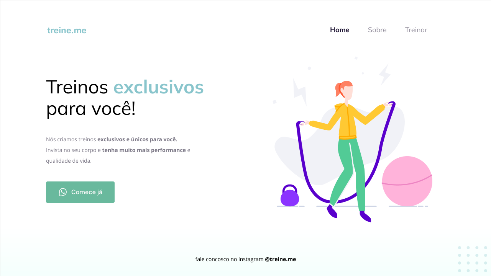

<h1 align="center"> Treinos exclusivos - Intermediário - Semântica e acessibilidade. 💜</h1>

Este é um projeto da RocketSeat do programa Explore composto por 20 módulos, com dezenas de aulas e tem como objetivo desenvolver habilidades técnicas e comportamentais a fim de que o aluno consiga se posicionar como profissional, conquiste oportunidades no mercado de trabalho e lide com desafios reais.são projetos do curso, promovido pela Rocketseat para ensino de tecnologias WEB.  

  <a href="#-tecnologias">Tecnologias</a>&nbsp;&nbsp;&nbsp;|&nbsp;&nbsp;&nbsp;
  <a href="#-link">Link</a>&nbsp;&nbsp;&nbsp;|&nbsp;&nbsp;&nbsp;
  <a href="#memo-licença">Licença</a>

  

 

  

 

[Visualise o Projeto aqui](https://explore-03-treinos-exclusivos.vercel.app/)

💻 Sobre o desafio
Realizei o desafio proposto durante o programa Explore da RocketSeat, que consistia em corrigir a semântica e a acessibilidade de um código HTML previamente desenvolvido.

Sabemos que a maior parte do conteúdo disponível na internet hoje pode se tornar acessível apenas com a utilização correta dos elementos do HTML.

Você receberá um código com o projeto desenvolvido durante a Fase 02, mas, ao contrário do que foi feito em aula, ele não apresenta a semântica correta.
Como você pode ver na imagem abaixo, a página (exceto o botão) continua funcionando normalmente mas, quando você abrir o código, vai se deparar com os elementos do HTML todos bagunçados... 👀

## 🚀 Tecnologias

Esse projeto foi desenvolvido com as seguintes tecnologias:

- HTML e CSS
- Git e Github
- Figma

## 🪐 Link

Você pode visualizar o projeto através [DESSE LINK](https://explore-03-treinos-exclusivos.vercel.app/). 

## :memo: Licença

Esse projeto está sob a licença MIT.

---

Criado pela [RocketSeat](https://app.rocketseat.com.br/me/tone-monte-05654) 💜 Feito com 💛 por [Tone Lopes](https://tonelopes.github.io/portfolio/#home)
